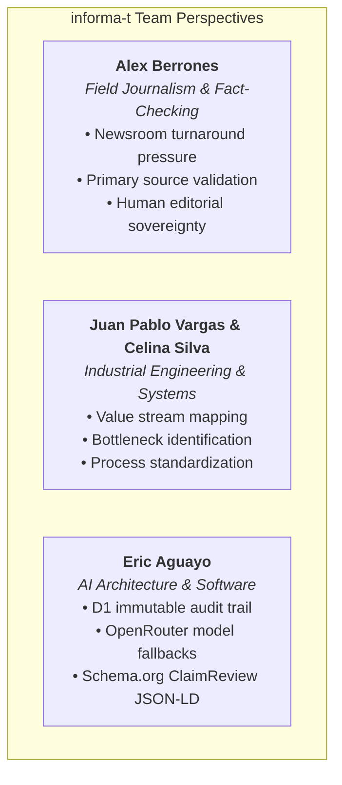
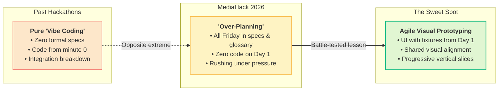

On August 14–15, 2026, [MediaHack 2026](https://openlab.ec/mediahack2026) brought together builders, journalists, and researchers in an intensive hackathon organized by **Openlab Ecuador**, the **Konrad Adenauer Foundation (KAS)**, **UNESCO**, and partner institutions dedicated to media innovation and public information integrity.

Participating in this event was an immensely enriching experience. Beyond the adrenaline of a 36-hour sprint, it offered profound insight into the real-world friction and time pressures investigative journalists face daily—especially during electoral seasons when coordinated disinformation spreads faster than traditional newsrooms can debunk it.

In this post, I want to share how our team tackled the challenge, the architectural and methodological choices behind our project **informa-t**, the leverage of a truly multidisciplinary team, and the engineering lessons learned when the planning pendulum swings too far.

---

## 1. The Power of a Multidisciplinary Team

One of our greatest advantages was the diverse composition of our squad:

- **Eric Aguayo**: Software Development and AI Systems Architecture.
- **Juan Pablo Vargas** and **Celina Silva**: Industrial Engineers with deep experience in process optimization, operational workflows, and systems analysis across various industries.
- **Alex Berrones**: Professional investigative journalist, whose firsthand experience in field reporting, community newsrooms, and fact-checking deadlines grounded every architectural decision we made.



When exploring what AI could do to combat electoral disinformation, ideas ranged widely: computer vision models for deepfake and voice cloning detection, knowledge graphs for narrative cluster mapping, and automated scrapers.

However, constrained by the 36-hour window and guided by Alex's reality check—where newsrooms struggle from manual source verification all the way to late debunk distribution—we made a crucial decision: **ruthlessly scope down to the core bottleneck**.

We were not trying to replace journalists or build an opaque "black box" that declares absolute truths. Instead, we designed an **editorial decision-support assistant** focused on extracting verifiable claims, cross-referencing against open institutional primary sources, and strictly enforcing human editorial sovereignty (*Human-in-the-Loop*).

---

## 2. Hackathon Dynamics and the Planning Pendulum

From previous hackathons, I had internalized two classic pitfalls:
1. **Writing code without deeply understanding the problem**, creating throwaway prototypes that miss the mark.
2. **Splitting into isolated silos on minute one**, only to suffer massive integration nightmares two hours before the pitch.

Determined to avoid these mistakes, we agreed that alignment had to come first. We dedicated almost **all of Friday** to defining the domain language, drafting formal specifications, agreeing on interface contracts, and building a structured execution plan to delegate to my AI agent harness.



### The Other Extreme of the Pendulum

While our conceptual clarity was rock-solid, we swung the pendulum too far: **we planned so thoroughly that we wrote zero code on Day 1**.

By Saturday morning, we were in a race against the clock. Even though our conceptual model and static specs covered every requirement, we committed to shipping a fully functional cloud deployment with D1 database audit trails, multi-model OpenRouter fallbacks, and live hosting at [informa-t.nimblersoft.com](https://informa-t.nimblersoft.com).

The infrastructure went live and the analysis pipeline worked, but wiring all the layers together under tight time constraints stole valuable hours that could have been spent polishing the user journey and refining our pitch narrative.

---

## 3. Battle-Tested Lessons Learned

### 1. A clear prototype communicates value better than a complex backend
In a fast-paced demo, judges evaluate **clarity of value, usability, and domain impact**. 

A clean, interactive walkthrough—even powered by controlled synthetic fixtures—communicates product vision far better than an invisible backend with failovers that judges cannot inspect in a 3-minute pitch. In our demo, we prioritized backend robustness so heavily that we underrepresented the visual flow of the editorial experience.

### 2. Prototype visually with *fixtures* from hour one
Even with meticulously written specifications, every team member pictures UI/UX differently in their head.

When our AI coding agents generated the interface from text specs, the result satisfied all functional contracts, but the interaction patterns differed from what we had visualized. Making deep UI adjustments that late in the sprint was risky and time-consuming.

**The key takeaway**: Build an interactive UI shell with synthetic data early in the process. Once the team agrees on the visual and interaction model, implement the system through progressive vertical slices.

---

## 4. What is informa-t: Transparency and Human-in-the-Loop

Despite the time crunch, the technical foundation of **informa-t** is robust, auditable, and cost-efficient:

- **Strict Human Sovereignty**: The system never issues automated public verdicts. It extracts discrete claims, provides primary evidence records (e.g., official datasets from CNE or INEC), and keeps the editorial verdict strictly in human hands.
- **Auditable Traceability**: Every model proposal is logged with immutable events—including model ID, cited sources, extracted rationale, uncertainties, and latency—eliminating black-box opacity.
- **Open Standards**: Native export to the global **ClaimReview (JSON-LD)** Schema.org format for search engine interoperability and fact-checking federation.
- **Zero-Budget Inexpensive Inference**: Built to run entirely on free-tier models via OpenRouter (such as `google/gemma-4-31b-it:free`, `glm-5.2`, and `nemotron-3-nano`), allowing independent newsrooms to deploy advanced AI verification without prohibitive compute costs.

```json
// Example of structured ClaimReview generated by informa-t
{
  "@context": "https://schema.org",
  "@type": "ClaimReview",
  "datePublished": "2026-08-15",
  "url": "https://informa-t.nimblersoft.com",
  "claimReviewed": "Claim regarding youth unemployment statistics cited in presidential debate",
  "reviewRating": {
    "@type": "Rating",
    "ratingValue": 2,
    "bestRating": 5,
    "alternateName": "Imprecise"
  },
  "author": {
    "@type": "Organization",
    "name": "Fact-Checking Newsroom Desk"
  }
}
```

---

## 5. Top 6 Finalists and Open Source for the Community

It was an exhausting yet rewarding weekend. Our team placed among the **Top 6 Finalists** at MediaHack 2026.

Beyond the competition, our proudest milestone is delivering a clean, open-source foundation that the community can adopt and extend:

- 📦 **GitHub Repository**: [https://github.com/Nimblersoft/informa-t](https://github.com/Nimblersoft/informa-t)
- 🌐 **Live Prototype**: [https://informa-t.nimblersoft.com](https://informa-t.nimblersoft.com)

The repository includes the accessible editorial shell, domain glossary, automated test suites (Vitest + Playwright covering WCAG 2.1 AA accessibility), and architecture specifications.

---

## 6. Looking Ahead: Let's Build Together

At **informa-t**, our stance is clear: artificial intelligence must empower investigative journalists with auditable tools, not automate editorial truth.

We are eager to continue developing this project based on availability, and we invite **news organizations, fact-checking collectives, community desks, and independent journalists**:

> If you want to pilot this tool, collaborate, or co-create a sovereign, transparent, and auditable solution against disinformation, let's talk.

Huge thanks to **Openlab Ecuador**, **KAS**, **UNESCO**, the mentors, jury, and fellow teams who made MediaHack 2026 an unforgettable experience!
