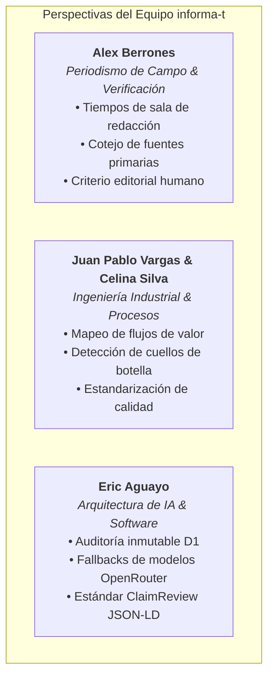
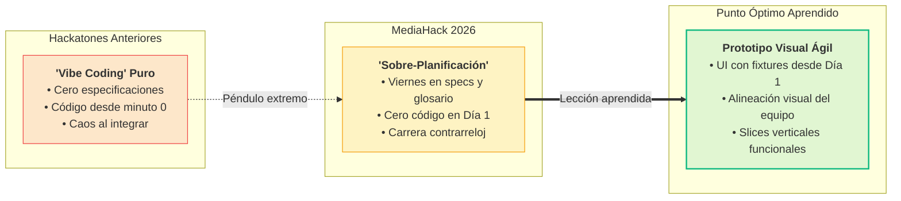

El pasado 14 y 15 de agosto de 2026 se llevó a cabo el [MediaHack 2026](https://openlab.ec/mediahack2026), un espacio intensivo convocado por **Openlab Ecuador**, la **Fundación Konrad Adenauer (KAS)**, la **UNESCO**, y diversas instituciones aliadas comprometidas con la innovación en medios y la integridad de la información pública. 

Participar en este evento fue una experiencia sumamente enriquecedora, tanto por los retos inherentes a la dinámica de un hackathon de alta intensidad como por el aprendizaje profundo sobre las complejidades y presiones que enfrenta el periodismo de verificación día a día, especialmente en periodos electorales donde la desinformación se propaga a una velocidad vertiginosa.

En este artículo quiero compartir cómo abordamos el desafío, las decisiones técnicas y metodológicas detrás de nuestro proyecto **informa-t**, el valor de un equipo verdaderamente multidisciplinario, y, lo más valioso de cualquier maratón de desarrollo, las lecciones aprendidas cuando el péndulo de la planificación se mueve al extremo.

---

## 1. La Fuerza de un Equipo Multidisciplinario

Uno de los mayores aciertos de esta edición fue la composición de nuestro equipo. Estuvo conformado por:

- **Eric Aguayo**: Desarrollo de software y Arquitectura de Sistemas de IA.
- **Juan Pablo Vargas** y **Celina Silva**: Ingenieros industriales con amplia experiencia en optimización de procesos, gestión operativa y análisis de sistemas en diversas industrias.
- **Alex Berrones**: Periodista profesional, cuyo conocimiento directo del terreno, las rutinas de redacción y las urgencias de los medios comunitarios fue el ancla de realidad de todo el proyecto.



Al sentarnos a debatir el abanico de posibilidades que la Inteligencia Artificial ofrece contra la desinformación electoral, surgieron múltiples vertientes: desde modelos de visión por computador para detectar *deepfakes* y clonación de voz, hasta grafos de conocimiento para mapear narrativas coordinadas en redes sociales. 

Sin embargo, frente al límite de 36 horas y la realidad operativa que Alex nos planteaba, donde los equipos periodísticos van desde la búsqueda manual de datos duros hasta la tardía difusión de desmentidos cuando el daño viral ya está hecho, tomamos una decisión clave: **acotar el alcance al núcleo del problema**. 

No buscábamos reemplazar al periodista ni crear una "caja negra" que emitiera juicios automáticos. Diseñamos un **asistente editorial de soporte a la decisión**, enfocado en la extracción rigurosa de aseveraciones (*claims*), el cotejo estricto con fuentes primarias institucionales abiertas y la preservación innegociable de la frontera editorial humana (*Human-in-the-Loop*).

---

## 2. La Estrategia del Hackathon y el Péndulo de la Planificación

En hackatones anteriores he comprobado en carne propia dos errores clásicos:
1. **Empezar a programar sin entender el problema**, construyendo código descartable a ciegas.
2. **Dividir el trabajo en silos individuales desde el minuto cero**, para luego sufrir integrando piezas incompatibles a dos horas de la presentación final.

Con esa experiencia previa, decidimos que la coordinación y el consenso debían primar. Dedicamos prácticamente **todo el viernes** a definir el dominio, redactar especificaciones funcionales formales, acordar contratos de interfaz y estructurar un plan detallado para luego delegar la implementación a mi *harness* de agentes de IA.



### El otro extremo del péndulo

Aunque la claridad conceptual que logramos fue impecable, caímos en el extremo opuesto: **planificamos tanto que no escribimos una sola línea de código el primer día**.

El sábado nos encontramos en una carrera contrarreloj. A pesar de que la propuesta conceptual y el prototipo estático cubrían los requerimientos, nos autoimpusimos el reto de entregar una aplicación 100% funcional, con persistencia en base de datos D1, integración multi-modelo vía OpenRouter y despliegue real en la nube en [informa-t.nimblersoft.com](https://informa-t.nimblersoft.com). 

La infraestructura se levantó y el pipeline respondió, pero el esfuerzo titánico de conectar todas las capas en pocas horas consumió tiempo valioso que pudo haberse destinado a pulir la experiencia de usuario y la narrativa del *pitch*.

---

## 3. Lecciones Aprendidas en la Trinchera

### 1. Un prototipo claro comunica mejor que un backend complejo
En una competencia de innovación, el jurado busca entender con total nitidez la **utilidad real, la pertinencia de la solución y el flujo de valor para el usuario final**. 

Un prototipo guiado y visualmente contundente —incluso con datos sintéticos controlados (*fixtures*)— comunica la visión del producto de manera mucho más eficaz que un backend complejo con fallbacks en vivo que el jurado rara vez llega a inspeccionar en un demo de 3 a 5 minutos. En nuestra demostración, nos concentramos tanto en la robustez técnica que nos quedamos cortos al evidenciar visualmente todo el potencial del flujo editorial ante los evaluadores.

### 2. Prototipar visualmente con *fixtures* desde el primer instante
Aunque redactamos especificaciones textuales rigurosas y consensuadas, cada miembro del equipo tenía en su mente una representación visual ligeramente distinta de la interfaz de usuario (UI/UX). 

Cuando los agentes de IA generaron la interfaz a partir de las especificaciones, el resultado cumplía con los contratos funcionales, pero no coincidía exactamente con lo que imaginábamos a nivel de interacción editorial. En esa etapa avanzada, realizar ajustes visuales profundos resultó complejo y riesgoso.

**El aprendizaje definitivo**: Lo ideal en un hackathon es prototipar la UI/UX visualmente de forma interactiva con datos estáticos desde las primeras horas. Una vez alineada y validada la experiencia visual por todo el equipo, se avanza en la implementación técnica mediante *vertical slices* progresivos que vayan dando vida a cada módulo.

---

## 4. Qué es informa-t: Transparencia y Human-in-the-Loop

A pesar de la carrera contrarreloj, el resultado técnico de **informa-t** fue sumamente sólido. Construimos un sistema fundamentado en la trazabilidad, la gobernanza y el bajo costo de operación:

- **Frontera Humana Innegociable**: El sistema no dictamina verdades. Extrae aseveraciones estructuradas (*Claims*) y presenta un registro auditable de fuentes primarias institucionales (ej. CNE, INEC) y contexto relacionado. La decisión y el veredicto final corresponden exclusivamente al periodista o editor.
- **Transparencia y Trazabilidad (Audit Trail)**: Cada propuesta generada por los modelos queda registrada en eventos inmutables, indicando modelo utilizado, fuentes citadas, incertidumbres y latencias, evitando cualquier tipo de "caja negra".
- **Estándares Abiertos**: Capacidad de exportación en formato estándar **ClaimReview (JSON-LD)** para interoperabilidad con motores de búsqueda y plataformas de verificación global.
- **Presupuesto Cero / OpenRouter**: El motor está optimizado para operar con modelos abiertos de alta capacidad en capa gratuita (como `google/gemma-4-31b-it:free`, `glm-5.2` y `nemotron-3-nano`), permitiendo a redacciones pequeñas e independientes acceder a tecnología de punta sin costos prohibitivos de inferencia.

```json
// Ejemplo de ClaimReview estructurado generado por informa-t
{
  "@context": "https://schema.org",
  "@type": "ClaimReview",
  "datePublished": "2026-08-15",
  "url": "https://informa-t.nimblersoft.com",
  "claimReviewed": "Afirmación sobre el porcentaje de desempleo juvenil citado en debate electoral",
  "reviewRating": {
    "@type": "Rating",
    "ratingValue": 2,
    "bestRating": 5,
    "alternateName": "Impreciso"
  },
  "author": {
    "@type": "Organization",
    "name": "Redacción Periodística / Mesa de Verificación"
  }
}
```

---

## 5. Finalistas y Código Abierto para la Comunidad

Fue una jornada extenuante pero profundamente gratificante. Logramos posicionarnos entre los **6 equipos finalistas** de MediaHack 2026.

Más allá del resultado del certamen, nuestra mayor satisfacción es haber liberado una base de código abierto, accesible y lista para ser continuada:

- 📦 **Repositorio en GitHub**: [https://github.com/Nimblersoft/informa-t](https://github.com/Nimblersoft/informa-t)
- 🌐 **Prototipo Desplegado**: [https://informa-t.nimblersoft.com](https://informa-t.nimblersoft.com)

El repositorio incluye la implementación del shell editorial, esquemas de datos, suites de pruebas automatizadas (Vitest + Playwright para accesibilidad WCAG 2.1 AA) y la documentación de arquitectura lista para que cualquier desarrollador, investigador o periodista pueda clonarlo y adaptarlo.

---

## 6. Mirando al Futuro: Construyamos Juntos

Desde el equipo que conformamos **informa-t**, mantenemos la convicción de que la inteligencia artificial debe ser una herramienta para empoderar a los periodistas, no para automatizar la verdad. 

Estamos en la total disposición de continuar impulsando este proyecto conforme a nuestra disponibilidad, y extendemos una invitación abierta a **medios de comunicación, redacciones independientes, colectivos de fact-checking y periodistas de investigación**:

> Si estás interesado en asociarte, probar la herramienta en tu redacción o colaborar en el desarrollo de una solución conjunta, democrática, auditable y segura contra la desinformación, conversemos.

Un agradecimiento sincero a **Openlab Ecuador**, **KAS**, **UNESCO**, a los mentores, al jurado y a todos los equipos que compartieron estas 36 horas de pura innovación. ¡Nos vemos en el próximo desafío!
